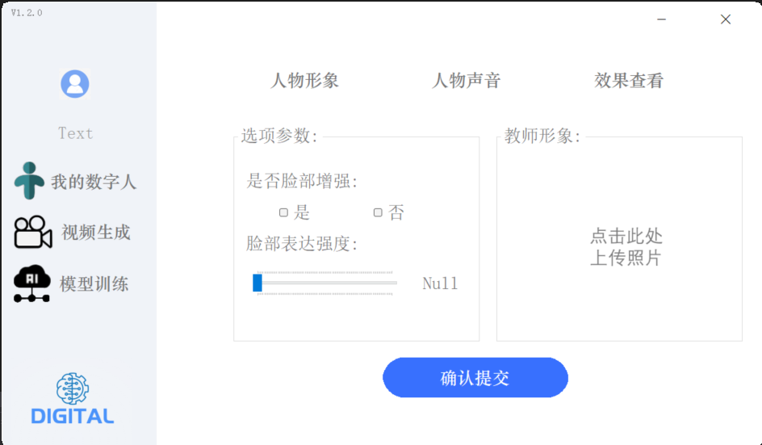
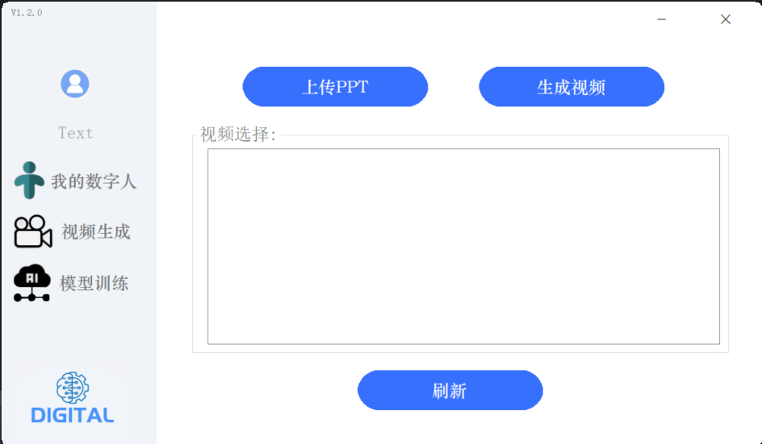
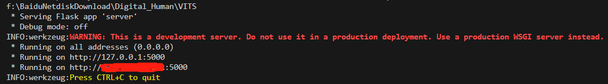
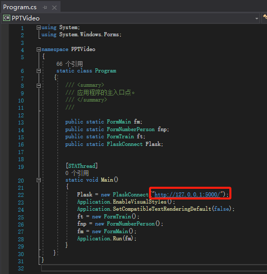
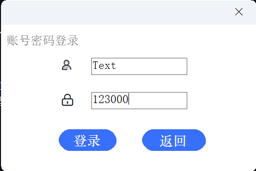
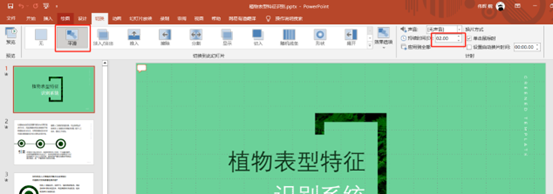

 # 数字人授课录制系统 — 全新的微课视频的生成方案

 <h1 align="center">Digital_Human_UI</h1>

 

  
 

## 版本
**1.2**

## 版本更新

**2024.06更新 (未发布)** 📆: 
- **完成了基础的UI界面。**
- **完成了UI跟API进行调用。**

**2024.07更新 (未发布)** 📆: 
- **更新了UI界面。**
- **加入了VITS的语音合成功能，让数字人的声音更生动。**

**2024.09更新 (开源🔥)** 📆: 
- **令人兴奋的消息！我们将该项目全套开源🔥🔥🔥**
- **把VITS的语音训练模块加入其中，能够通过微调一分钟对应人的语料进行克隆。**

> [!IMPORTANT]
>
> 🔆 该项目也在持续的更新阶段，如果您有任何关于新的模型方法、研究、技术或发现运行错误的建议，请随时编辑并提交 PR。⭐ 如果您发现这个Github Project有用，请给它点个星！🤩🤩

## 简介

数字人授课录制系统是由AI Horizons团队设计并开发的教育技术工具，旨在通过先进的数字人技术，为教育领域提供个性化、专属化的PPT授课视频制作和展示体验。该系统支持用户自定义数字人形象和声音，简化视频生成流程，提高教学内容的吸引力和教学效率。

## 软件介绍

该软件是使用winfrom框架构建的一个简单windows应用程序，该应用程序的主要目的是

**提供可视化界面：**
该程序提供了一个简单的操作界面，可以直观的展示数字人授课视频生成的方式。

 

  
 

 **用户交互：**
 通过该程序，用户可以简单的上传照片、音频、ppt等，完成简单的视频生成。

 

  
 

  

  
 

  

  
 

 **提供音频克隆界面：**
可以在软件上进行简单的VITS声音克隆。

  

  
 

 ## 效果演示 

 链接

 **1、拉取代码**
 https://www.codewithgpu.com/i/Kedreamix/Linly-Talker/Kedreamix-Linly-Talker

**2、配置环境**
- **VS2019安装，安装方法参考http://t.csdnimg.cn/oJsW0，安装后打开本项目**
- **管理NuGet程序包，安装NAudio和Newtonsoft.Json。**
- **启动Digital_Human_API后端服务，获取http链接。**

  
 

- **打开项目的Program.cs文件，修改http链接。**

  
 

 - **启动项目，输入账号密码进行登录，账号：Test，密码：123000。**

 

  
 

 （该项目没有接入数据库，用的是json保存账号密码，如果需要增加用户，需要在Digital_Human_API项目里的DataBase/Login.json里添加）

## 使用注意事项

 因为该项目可能存在一些视频生成失败的结果，这就需要外部进行协调来降低这个可能，因此，如果出现了视频生成失败，非常欢迎大家提出建议，激励我们不断优化该项目。

**PPT制作要求**
 - **视频和GIF动画的兼容性说明：**
 在你的PPT内容中，如果包含视频或GIF动画，请注意，通过本该项目转换生成的授课视频目前不支持这些媒体文件的播放功能。因此，建议PPT内容中不加入视频或GIF动画。

 - **页面过渡动画的设置：**
 为了使你的PPT演示更加流畅和，我们建议在每一页幻灯片之间**添加过渡动画，切换时间为2秒**,（可保留动画窗格）这样通过本软件生成会效果会更好。（建议选择平滑）

 

  
 

 - **幻灯片右下角的空白区域：**
 在设计PPT时，请在每张幻灯片的右下角预留一个空白区域，用于展示数字人，大概范围可参考下图。

 

  
 

 - **PPT批注内容：**
  **需要在对一页都写上对应的讲稿（批注）**，该系统会自动获取批注内容做为该页的演讲内容，一页ppt只能有一个批注。（同时也可以把讲稿写到一份word里面发给我们）

 

  
 

**声音训练需求**

 - **录一段1~3分钟以内的WAV音频。**
 - **把这个WAV分割多段3~10秒的音频进行提交训练。**
 - **音频需要纯洁的人声音频，不能有杂音。**

 ## 参考

数字人生成使用的是SadTalker。

**SadTalker：**
https://github.com/OpenTalker/SadTalker

感谢开源贡献，我借鉴了当前开源的语音克隆模型 GPT-SoVITS，效果是相当不错，当然，我也把一些训练好的权重放在了百度云盘里面，可以用于参考使用。

**GPT-SoVITS ：**
https://github.com/RVC-Boss/GPT-SoVITS

该软件的后端服务。

**Digital_Human_API：**

## 许可协议

本项目遵循 MIT Licence。在使用本工具时，请遵守相关法律，包括版权法、数据保护法和隐私法。未经原作者和/或版权所有者许可，请勿使用本工具。未经原作者和/或版权所有者许可，请勿使用本工具。此外，请确保遵守您参考的模型和组件中的所有许可协议。

## 技术支持和联系方式

如果您在使用过程中遇到任何问题，请联系我们的技术团队：
**公众号：AI Horizon**

  
 

